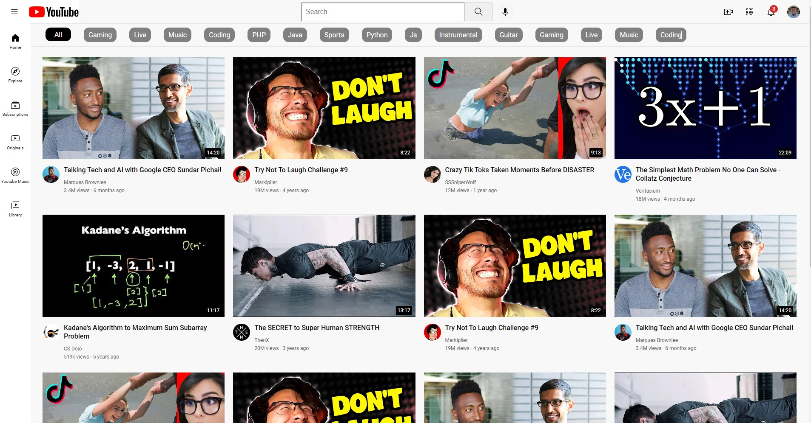

# YouTube UI Clone (HTML & CSS)

This project is a replica of the YouTube user interface (UI) built using HTML and CSS. It aims to recreate the basic layout and visual elements of the YouTube website, including:

## Tech Stack

**Tech:** HTML, CSS,

## Installation

Install my-project

```bash
1. Clone this repository.
2. Open the index.html file in your web browser.
3. Port = 5641 (Adjustable)
```

## Screenshots



## Feedback

If you have any feedback, please reach out to us at https://github.com/martuahutapea/

## License

[MIT](https://choosealicense.com/licenses/mit/)
